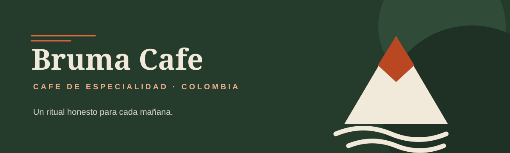

# Bruma Café

Landing page estática de una tienda de café de especialidad. Proyecto académico construido con HTML y CSS para presentar una marca, su catálogo y contenido informativo en una sola página.

## Inicio rápido

No requiere instalación, dependencias, compilación ni scripts.

1. Abre la carpeta del proyecto.
2. Abre [`index.html`](index.html) en un navegador web.

La página funciona con archivos locales. Tipografías DM Sans y Fraunces, además de imágenes del catálogo, se cargan desde servicios externos; una conexión a Internet permite mostrarlas correctamente. Si fuentes no están disponibles, navegador usa tipografías genéricas de respaldo.

## Estructura de archivos

```text
.
├── index.html
├── css/
│   └── styles.css
└── assets/
    ├── logo.svg
    └── banner.svg
```

- `index.html`: contenido, estructura semántica, navegación, catálogo, formulario y preguntas frecuentes.
- `css/styles.css`: estilos, distribución con Grid y Flexbox, estados de foco y adaptación responsive.
- `assets/logo.svg`: logotipo vectorial usado en encabezado, pie de página y favicon.
- `assets/banner.svg`: banner editorial del proyecto.

## Contenido

- Doble navegación: menú superior y menú lateral por anclas.
- Catálogo con tres productos y etiquetas de estado.
- Especificaciones técnicas y tabla de garantías.
- Promociones, categorías e indicadores de stock y satisfacción.
- Formulario de registro con campos agrupados y preguntas frecuentes expandibles.
- Diseño responsive para escritorio, tablet y móvil.
